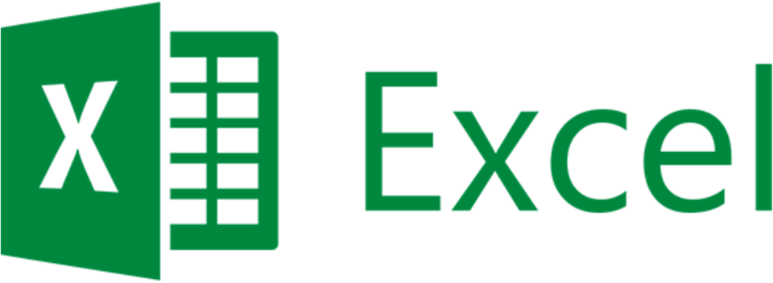

# Demo Swift Excel Xlsx Reader Writer



This demonstration shows:

  * The [Swift](http://swift.org) programming language with
    [Apple](http://apple.com)
    [Xcode](https://developer.apple.com/xcode/)
    [iOS](http://www.apple.com/ios/)

  * How to use [XlsxReaderWriter](https://github.com/renebigot/XlsxReaderWriter),
    which is an Objective-C library, to read [Microsoft Excel](https://en.wikipedia.org/wiki/Microsoft_Excel)
    files by using [Office OpenXML](https://en.wikipedia.org/wiki/Office_Open_XML).

Example code to load a spreadsheet and print a cell value:

```swift
let spreadsheet: BRAOfficeDocumentPackage = BRAOfficeDocumentPackage.open(path)
let worksheet: BRAWorksheet = spreadsheet.workbook.worksheets[0] as! BRAWorksheet
let cell: BRACell = worksheet.cellForCellReference("A1")
print(cell.stringValue())
```    


## Start

To use this demo, you can clone this repo, or you can use this README to create your own project.

If you clone this repo, then be aware that there are multiple git branches, so pick the one you want.

  * swift-4-xcode-9: Swift version 4, Xcode version 9, iOS version 11.

  * swift-3-xcode-8: Swift version 3, Xcode version 8, iOS version 10.


## Create the project

Launch Xcode and create a new Xcode project. 

  * Use iOS template "Single View Application" and Product Name "Demo Swift Excel Xlsx Reader Writer".

  * [Help](doc/setup/create_a_new_xcode_project.md)
 

## Get XlsxReaderWriter

Get the repository, and put it in the the same folder as our demo project's xcodeproject:

```shell
git clone --depth=1 https://github.com/renebigot/XlsxReaderWriter.git
```

If you want to confirm you put in the in the expected place, do the command `ls`:

```shell
Demo Swift Excel Xlsx Reader Writer
Demo Swift Excel Xlsx Reader Writer.xcodeproj
Demo Swift Excel Xlsx Reader WriterTests
Demo Swift Excel Xlsx Reader WriterUITests
XlsxReaderWriter
```


## Link

Add the file `XlsxReaderWriter.xcodeproj` to the project, within the 

Add dependency:

  * Choose: Targets → Demo Swift Excel Xlsx Reader Writer 
  * → Build Phases → Target Dependencies
  * Add: `XslxReaderWriter` → `XslxReaderWriter`

Link binaries:

  * Choose: Targets → Demo Swift Excel XlsxReaderWriter 
  * → Build Phases → Link Binaries With Libraries
  * Add: `libXlsxReaderWriter.a` (which is in the XlsxReaderWriter folder)
  * Add `libz.tbd` (which is in the standard list of Apple items). The `libz.tbd` is more current than the older version named `libz.dylib`.

Linking:

  * Choose: Targets → Demo Swift Excel Xlsx Reader Writer 
  * → Build Settings → All → Linking → Other Linker Flags
  * → Debug → (+) → Any Architecture | Any SDK
  * Add: `-all_load`
  * → Release → (+) → Any Architecture | Any SDK
  * Add: `-all_load`
  
Search Paths:

  * Project → Demo → Build Settings → Search Paths → User Header Search Paths
  * → Debug → (+) → Any Architecture
  * Set it to: `$(SRCROOT)/XlsxReaderWriter/` not `$(SRCROOT)/XlsxReaderWriter/XlsxReaderWriter/`.
  * Select "recursive".
  * → Release) → (+) → Any Architecture
  * Set it to: `$(SRCROOT)/XlsxReaderWriter/` not `$(SRCROOT)/XlsxReaderWriter/XlsxReaderWriter/`.
  * Select "recursive".

Bridging Header:

  * Create a new file to Xcode (File > New > File), then see the “Source” section, and click “Header File“. If an icon for "Header File" doesn't appear, then use the search box and type "Header".
  * We like the file name `Bridge.h`
  * Add this code:

    ```swift
    #ifndef Demo_Swift_Excel_Xlsx_Reader_Writer_Bridging_Header_h
    #define Demo_Swift_Excel_Xlsx_Reader_Writer_Bridging_Header_h
    #import "XlsxReaderWriter-swift-bridge.h"
    #endif /* Demo_Swift_Excel_Xlsx_Reader_Writer_Bridging_Header_h */
    ```

Add the bridge:

  * Project → Demo → Build Settings → Swift Compiler - General → Objective-C Bridging Header
  * → (Debug & Release) → (+) → Any Architecture | Any SDK → Add: `Bridge.h`


## Run

Run the project to verify it works so far.

It should compile then launch the simulator.


## Troubleshooting

Build error "'XlsxReaderWriter-swift-bridge.h' file not found":

  * Ensure that you've created the search paths as described above, and that they are both recursive.


## Load an Excel file

This demo repository has an Excel file `demo.xlsx`.

  * You can use this file as is. The cell A1 has the word "Alpha".

  * Or you can create your own file by using your own Excel software, or any Excel-compatible software.

Add the file to the project.


## Write the code

Edit `ViewController.swift`:

```swift
import UIKit

class ViewController: UIViewController {

  override func viewDidLoad() {
    super.viewDidLoad()

    // Set the path to the path of wherever you put your Excel file.
    // The path in this demo code is the path to the demo.xlsx file.
    let path: String = Bundle.main.path(forResource: "demo", ofType: "xlsx")!


    // Open the spreadsheet, get the first sheet, first worksheet, and first cell A1.
    // This is solely demo code to show basics; your actual code would do much more here.
    let spreadsheet: BRAOfficeDocumentPackage = BRAOfficeDocumentPackage.open(path)
    let sheet: BRASheet = spreadsheet.workbook.sheets[0] as! BRASheet
    let worksheet: BRAWorksheet = spreadsheet.workbook.worksheets[0] as! BRAWorksheet
    let cell: BRACell = worksheet.cell(forCellReference: "A1")

    // Print some info to show the code works.
    print(sheet.name) // print "Sheet1"
    print(cell.stringValue()) // print "Alpha"
  }

  override func didReceiveMemoryWarning() {
    super.didReceiveMemoryWarning()
  }

}
```

## Run

Run the project.

  * It should compile and launch a blank simulator.

  * The Xcode console should now show the text "Sheet1" and "Alpha".

Congratulations, you're successful!


## Troubleshooting

If this line fails at runtime: 

```swift
let path: String = Bundle.main.path(forResource: "demo", ofType: "xlsx")!
```

Then the app is unable to find the file `demo.xlsx`.

Verify that the file is at the top level of the project.


## Tracking

* Package: demo_swift_excel_xlsx_reader_writer
* Version: 3.0.0
* Created: 2016-07-02
* Updated: 2017-09-22
* License: BSD, GPL, MIT
* Contact: Joel Parker Henderson (joel@joelparkerhenderson.com)
